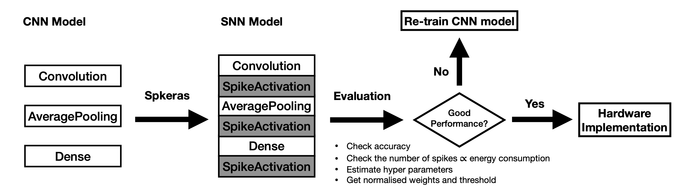

<!-- PROJECT LOGO -->


<!-- TABLE OF CONTENTS -->


<!-- ABOUT THE PROJECT -->
## Spkeras 2.0


Spkeras can easily get and evaluate rate-based spiking neural networks (SNNs), by following steps:
* Pre-train Convolutional neural networks (CNNs) using Tensorflow-keras
* Convert CNNs into SNNs using Spkeras
* Evaluate SNNs and get parameters, e.g. weights, bias and thresholds

### Built With
Spkeras has extension layers, e.g. CurrentBias and SpikeForward, following Tensorflow-keras design syntax. 
* [Tensorflow-keras](https://www.tensorflow.org/guide/keras/sequential_model)

## New Features
* Works with Keras Functional API, for example:
    * convert add layer

<!-- GETTING STARTED -->
## Getting Started
The package is tested in Python 3.7.6 and Tensorflow 2.3.1.

### Prerequisites

1. Install tensorflow
```sh
pip install tensorflow
```

### Installation

1. Clone the repo
```sh
git clone https://github.com/(Anonymous)/spkeras.git
```
### Example
```python
#load dataset and cnn model
from tensorflow.keras.datasets import cifar10
from tensorflow.keras.models import load_model

(x_train, y_train), (x_test, y_test) = cifar10.load_data()
x_train = x_train/255
x_test = x_test/255
x_train = x_train.astype('float32')
x_test = x_test.astype('float32')
y_train = keras.utils.to_categorical(y_train, 10)
y_test = keras.utils.to_categorical(y_test, 10)

cnn_model = load_model('cnn_model.h5')

#Convert CNN into SNN
from spkeras.models import cnn_to_snn

#Current normalisation using cnn_to_snn
##Default: signed_bit=0, amp_factor=100, method=1, epsilon = 0.001

snn_model = cnn_to_snn(signed_bit=0)(cnn_model,x_train)

#Evaluate SNN accuracy
##Default: timesteps=256, thresholding=0.5, scaling_factor=1, noneloss=False, spike_ext=0 
_,acc = snn_model.evaluate(x_test,y_test,timesteps=256)

#Count SNN spikes
##Default: timesteps=256, thresholding=0.5, scaling_factor=1, noneloss=False, spike_ext=0, mode=0
s_max,s = snn_model.SpikeCounter(x_train,timesteps=256)

#Count neuron numbers
##Default: mode = 0
n = snn_model.NeuronNumbers(mode=0)
```

#### Attributes
```python
'''
--------------------------
cnn_to_snn
--------------------------
sigbed_bit: bitwidth of weights, default 0 (32-bit) 
amp_factor: amplification factor, default 100
method    : default 1
epsilon   : 0.001
--------------------------
evaluate & SpikeCounter
--------------------------
timesteps   : inference time, default 256.
thresholding: default 0.5.
noneloss    : noneloss mode, default False.
spike_ext   : extra inference time, default 0. (-1 for unlimited inference time) 
--------------------------
SpikeCounter
--------------------------
mode: set 1 to count number of neurons under different spikes, default 0
--------------------------
NeuronNumber
--------------------------
mode: set 1 to exclude average pooling layer, default 0
'''
```
<!-- USAGE EXAMPLES -->
## Usage

_For more examples, please refer to the [Examples](./examples/)_

<!-- LICENSE -->
## License

Distributed under the MIT License. See `LICENSE` for more information.


<!-- PUBLICATION -->
## More details
<a href="https://arxiv.org/abs/2103.00944">paper</a>

